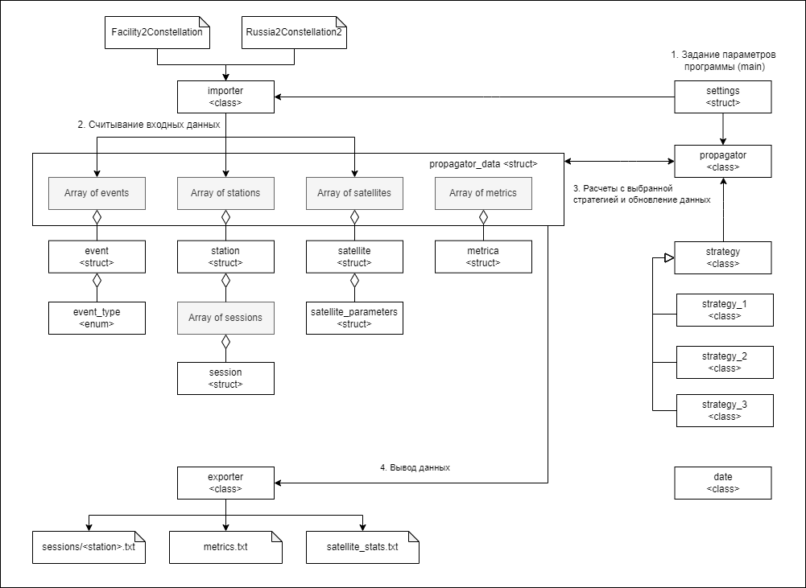

# Содержание

1. [Структура репозитория](#structure)
2. [Документация кода](#docs)
3. [Решение](#solution)
4. [Результаты](#conclusion)

# 1. Репозиторий 

- .vscode - директория со метаданными Visual Studio Code.
- presentation - директория с презентацей команды.
- task - директория с постановкой задачи.
- uniorb - директория с решением.
  - build - сборка (проект для Visual Studio 2019)
  - data - исходные данные.
  - docs - файлы для документации.
  - include - заголовочные файлы библиотеки.
  - output - результаты вычислений (структуру см. ниже).
  - release - исполняемый файл (использование см. ниже).
  - script - вспомогательные скрипты для сборки.
  - source - исходные файлы библиотеки.
  - test - программа, показывающая использование библиотеки.

### Сборка с помощью cmake

1. Перейти в build
2. Очистить кэш cmake = удалить CMakeCache.txt
3. Выполнить сборку командой "cmake .."
4. Скомпилировать программу msbuild UNIORB.sln /p:Configuration=Release

Также можно собирать через UI интерфейс без cmake.

### Запуск исполняего файла

На вход подаются три агрумента в указанном порядке:

- Полный путь до директории Russia2Constellation2
- Полный путь до директории Facility2Constellation
- Полный путь до директории для выходных файлов

Программа сама выводит время, потраченные на различных этапах, а также кратко информирует об основных ошибках и ключевых метриках задачи (в stdout).

# 2. Документация кода 
### Общая информация

Реализовано на С++17 без использования сторонних зависимостей.

### Документация API

Код снабжен комментариями с описанием входных / выходных данныех основных классов и функций.

Краткое описание сущностей:

- date - класс для работы с эпохой, умеет преобразовывать текстовый формат времени ISO в числовой.
- event_type - перечисление типов событий.
- event - cтруктура события, ключевая сущность решения.
- exporter - класс для вывода данных.
- importer - класс для считывания входных данных.
- metrica - структура метрики, рассчитывается для каждого события.
- propagator_data - структура данных для пропагатора.
- propagator - класс для выполнения расчетов согласно решение, основной метод класса propogate на вход принимает стратегию strategy, определяющий расчеты.
- satellite_parameters - структура с параметрами спутника.
- satellite - струткура спутника.
- session - структура сессии передачи данных со спутника на станцию.
- settings - структура параметров программы, таких как атрибуты спутников разных типов, пути к директорям.
- station - структура станции.
- strategy_1 - реализации Стратегии 1 (см. ниже).
- strategy_2 - реализации Стратегии 2 (см. ниже).
- strategy_3 - реализации Стратегии 3 (см. ниже).
- strategy - абстракный класс стратегии, является основной для конкретный реализаций.

Примечание: 

- код далек от совершенства, создавался быстро, чтобы был понятным и корректно работал.
- для быстродействия внутри программы работа с объектами происходит по целочисленному ID, который присваивается автоматически при создании объектов. ID начинаются с 1. 0 используется для обозначения отсутствия.

### Выходные данные

На выходе получаем:
- три директории с данными расчетов по соответствующим стратегиям.
- events.txt - список всех событий, которые считала программа (используется для проверки и отладки).

Структура директории с данными расчетов по стратегии:
- sessions - директория с сессиями в формате, согласно ТЗ.
- metrics.txt - файл с ключевыми метриками на начало каждого события (используется для проверки и отладки). Колонки:
  - Date - дата.
  - Satname - название спутника.
  - Event - текстовое описание события.
  - Free sats - количество спутников, с которых не ведется передача данных на станции.
  - Loading sats - количество спутников, с которых ведется передача данных на станции.
  - Finished - количество спутников, которые выгрузили полностью все данные на момент начала события (зачем нужно - см. [ниже](#download_finish)).
  - Overloaded - количество спутников, у которых бортовая память полностью занята.
  - Used, GB - суммарный объем занятой бортовой памяти у всех спутников, GB.
  - Passed, GB - суммарный объем данных, переданных на землю, GB.
- satellite_stat.txt - файл со статистикой по спутникам (используется для проверки и отладки). Колонки:
  - Satname - название спутника.
  - Passed, GB - суммарный объем переданных данных со спутника (можно сверять через grep по файлам сессий), показывает эффективность использования спутников.
  - Input, GB/s - скорость записи данных на диск, GB/s.
  - Output, GB/s - скорость передачи данных на станцию, GB/s.
  - Storage, GB - объем бортовой памяти, GB.

# 3. Решение 

### Общая идея

Задача имеет огромное количество параметров, и формально можно решать оптимальную задачу и искать глобальный максимум, однако прямое такое решение, очевидно, будет крайне вычислительно затратным. поэтому мы используем упрощенную математическую модель, в основе которой лежат события.

__Событие__ - это фиксация некоторого факта. Фактически большая часть событий указано в исходных данных:

1. station_entrance - вход спутника S в зону видимости станции T.
2. station_exit - выход спутника S из зоны видимости станции T.
3. russia_entrance - вход спутника S на территорию России.
4. russia_exit - выход спутника S с территории России.

При наступлении каждого события мы рассчитываем параметры системы (сколько данных на каком спутнике и т.д.), а также принимаем решение для событий station_entrance и station_exit, с какого спутника должна скачивать данные станция.

Алгоритм принятия решения, с какого спутника должна скачивать данные станция, называется __Стратегия__.

Таким образом, выбирая ту или иную стратегию, определяющую локального поведение станции, мы можем менять глобальные результаты. В некоторым смысле можно провести аналогию с "жадным алгоритмом".

Особенности данного подхода:

1. Задача колоссально упрощается по сравнению с задачей прямой оптимизации, при этом практический результат, ожидаемо, не должен быть существенно ниже.
2. Модель крайне простая - все, что требуется, определить и подобрать нужную Стратегию. 
3. Позволяет легко учитывать __физические ограничения__, и довести решение до вполне физичного (учитывать скорость наведения станции на спутники, добавить ограничение по минимальному времени сеанса, чтобы не вертеть станицей и т.д.).
4. Позволяет отдавать приоритет тем или иным спутникам, например, когда необходимо получить данные с определенных спутников в первом приоритете (достаточно учесть это в Стратегии, см. пример Стратегии 2).
5. Вместо интегрирования по времени, мы переходим к дискретной задаче по событиям - это кардинально ускоряет выполнение алгоритма.
### Стратегия

Стратегия принимает на вход:

1. Станцию
2. Спутник, с которого в данный момент станция скачивает данные (при наличии)
3. Список и параметры спутников, которые находятся в зоне видимости станции, включая факт передачи данных этими спутниками на другие станции

На выходе получаем спутник, с которого необходимо выгружать данные, в том числе такого спутника может и не быть (ID = 0), если:
1. Нет спутников в зоне видимости
2. Нет спутников, у которых занята бортовая память, и они не ведут выгрузку на другие станции

__Стратегия 1__

Станция скачивает данные со спутника с максимально заполненной бортовой памятью.

__Стратегия 2__

Станция скачивает данные со спутника, который может передавать данные с наибольшей скоростью (приоритет Киноспутникам). При равных скоростях передачи приоритет отдается спутнику с максимально заполненной бортовой памятью.

__Стратегия 3__

Станция не скачивает никаких данных. Используется для отладки решения. Аналогично можно рассмотреть стратегию, когда данные скачиваются только с Зорких / Киноспутников.

### Обработка событий

Для обработки событий используется классы propagator и strategy.

Идем по всем событиям, считанным из исходных данных, упорядоченные по времени, и выполняем два шага:

__1. Обновление параметров системы на начало события и расчет метрик__

На вход подается моменты времени T0 предыдущего и T1 нового события и данные пропагатора.

На выходе обновляется состояние satellite_store и возвращаются метрики.

1. Считаем дельту времени T = T1 - T0.
2. Для всех спутников системы:
   1. Если спутник не выгружает данные на станцию:
      1. Если спутник летит над Россией в подходящее время для съемки, добавляем объем занятой бортовой памяти (идет съемка), с учетом ограничения на максимальный объем.
      2. Делаем +1 к числу спутников, которые не выгружают данные (satellite_free_count).
   2. Если спутник выгружает данные на станцию:
      1. Убавляем объем занятой бортовой памяти (идет передача), с учетом ограничения 0 снизу. В атрибуты спутника фиксируем суммарно переданный им объем данных.
      2. Если данные со спутника скачались полностью, делаем +1 к числу спутников, у которых полностью завершилась передача satellite_memory_empty_count (см. [зачем это нужно было делать](#download_finish)).
      3. Добавляем переданный объем данных в суммарный объем данных, переданных в рамках сеанса.
      4. Делаем +1 к числу спутников, которые выгружают данные (satellite_loading_count).
   3. Считаем суммарный объем занятой бортовой памяти спутников used_total, переданных данных passed_data и количество спутников с заполненной бортовой памятью satellite_overloaded_count.
3. Возвращаем метрики:
   1. satellite_free_count
   2. satellite_memory_empty_count
   3. satellite_loading_count
   4. used_total
   5. passed_data
   6. satellite_overloaded_count

__2. Обработка события__.

Зависит от типа события.

_station_entrance_ - вход спутника S в зону видимости станции T:

1. Добавляем спутник S в зону видимости станции T.
2. Если спутник S в данный момент скачивает данные на другую станцию - обработка не требуется.
3. Иначе:
   1. Получаем ID спутника, данные с которого должна скачивать станция согласно выбранной стратегии.
   2. Если ID спутника, с которого скачивает станция, меняется, необходимо обновить параметры:
      1. Если станцию скачивала данные с некоторого спутника (ID != 0), то завершаем с ним сессию, устанавливаем в атрибутах спутника, что он больше не передает данные для скачки.
      2. Обновляем в атрибутах станции ID спутника, с которого она ведет скачивание (может быть и 0, если скачивание прекратили).
      3. Если новый спутник есть (ID != 0), то создаем новую сессию и обновляем в атрибутах нового спутника ID станции, которая скачивает с него данные.

_station_exit_ - выход спутника S из зоны видимости станции T.

Полностью аналогично _station_entrance_, кроме шага 1: Убираем спутник S из зоны видимости станции T.

_russia_entrance_ - вход спутника S на территорию России.

1. Добавляем атрибут спутника S, что он летит над Россией в подходящее время для съемки.

_russia_exit_ - выход спутника S с территории России.

1. Убираем атрибут спутника S, что он летит над Россией в подходящее время для съемки.

### Примечание о событии download_finish 

В коде реализован тип событий download_finish.

Его смысл в следующем:

1. Так как расчет идет дискретно по событиям, основанным на исходных данных, то может оказаться, что между событиями станция полностью выгрузит все данные со спутника и необходимо ее переключить на другой спутник, чтобы не терять ценное время.
2. На практике была исследована метрика Finished - количество спутников, которые выгрузили полностью все данные на момент начала события.
3. Это объяснимо, так как интервалы времени между событиями крайне малы, и вероятность получить такую ситуацию крайне мала. Более того, эффект от нее маленький, но это усложняет код.
4. При необходимости эту обработку можно вернуть, она отключена, так как на реальных данных не нужна.

### Проверка результатов расчетов

- Проверка массива событие по events.txt путем сверки с исходными файлами с помощью grep.
- Выборочная проверка по станциям и спутникам по метрикам metrics.txt, satellite_stats.txt + с помощью grep по файлам сессий.
- В результате проверок нарушений условий ТЗ не выявлено.

# 4. Результаты 

Выходные файлы в директории output.

Результаты по стратегиям:

1. Стратегия 1.
   1. Минут до первого спутника с полностью заполненной бортовой памятью: 3475
   2. Суммарный объем данных GB, переданных на Землю: 683159
   3. Время работы алгоритма: 1.313 секунд
2. Стратегия 2.
   1. Минут до первого спутника с полностью заполненной бортовой памятью: 1921
   2. Суммарный объем данных GB, переданных на Землю: 476219
   3. Время работы алгоритма: 1.382 секунд
2. Стратегия 3.
   1. Минут до первого спутника с полностью заполненной бортовой памятью: 378
   2. Суммарный объем данных GB, переданных на Землю: 0
   3. Время работы алгоритма: 0.866 секунд

Наиболее интересной оказалось самая простая Стратегия 1. Были рассмотрены и другие варианты, но мы остановились на этих.

По Стратегиям 1 и 2 интересно отметить, что в среднем станции практически всегда скачивают данные (все 14 станций). Данные со спутников скачиваются относительно равномерно, то есть покрытие снимков однородное (см. satellite_metrics.txt). Стратегия 3 лишь показывает, что если не скачивать данные со спутников, то к 378 минуте появится первый спутник с переполненной бортовой памятью, а через двое суток к 03 Jun 2027 04:21:46.623 уже все спутники полностью исчерпают лимит.

Подводя итог, полученный подход обработки событий и стратегии выбора спутника для передачи данных довольно прост в понимании и может быть применен для прикладных задач без усложнений. Алгоритм работает очень быстро.

Важно отметить, что таким подходом можно на каждой обработке события рассматривать все варианты выбора спутника и просчитать все возможные ветки (по оценке их получается триллионы), чтобы найти самый оптимальный вариант. Но это требует значительных вычислительных мощностей, при этом сама реализация такого алгоритма остается довольно простой.
